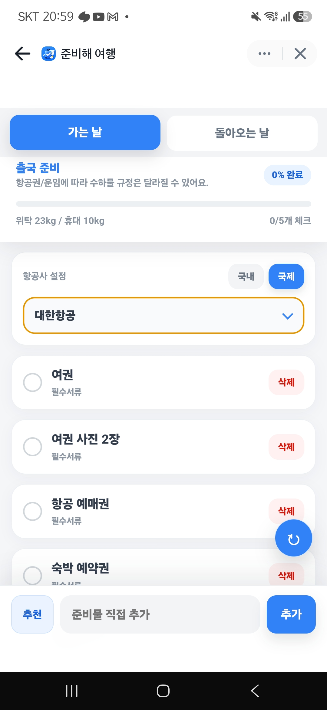
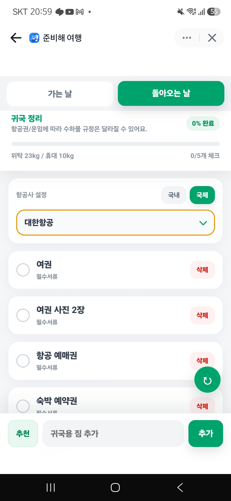
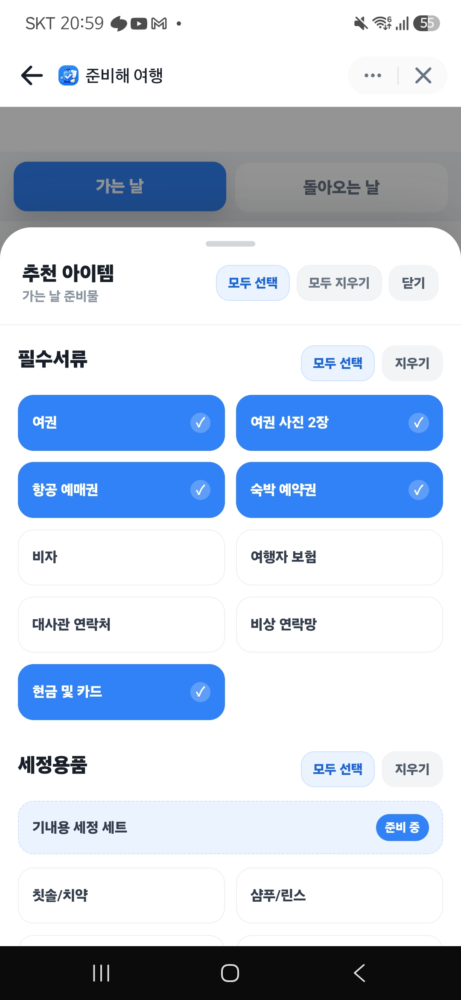

Apps in Toss · 실제 서비스 출시 · 현재 운영 중

  

# 준비해여행

### 여행 상황에 맞는 준비물을 추천하고 관리할 수 있는 여행 준비 체크리스트 서비스

실제 서비스 출시 · 현재 운영 중

---

## Overview

준비해여행은 토스 미니앱(Apps in Toss) 환경에서 운영 중인 여행 준비 체크리스트 서비스입니다.

여행 준비 과정에서 반복적으로 발생하는 준비물 누락 문제를 해결하기 위해 개발했습니다.

---

## Result

| 항목 | 내용 |
|------|------|
| 플랫폼 | Apps in Toss (토스 미니앱) |
| 상태 | 실제 서비스 출시 |
| 운영 상태 | 현재 운영 중 |
| 누적 사용자 | 약 110명 |
| 일 사용자 | 1 ~ 7명 |

---

## Screenshots

### 메인 체크리스트

  

### 귀국 준비 체크리스트

  

### 추천 준비물

  

---

## Documents

더 자세한 내용은 아래 문서에서 확인할 수 있습니다.

* [Project Note](docs/project-note.md)
* [Retrospective](docs/retrospective.md)

---

## Tech Stack

React · TypeScript · Vite · Tailwind CSS · Apps in Toss

---

## One Sentence

사용자의 불편함을 발견하고 실제 서비스로 만들어 운영해 본 프로젝트
